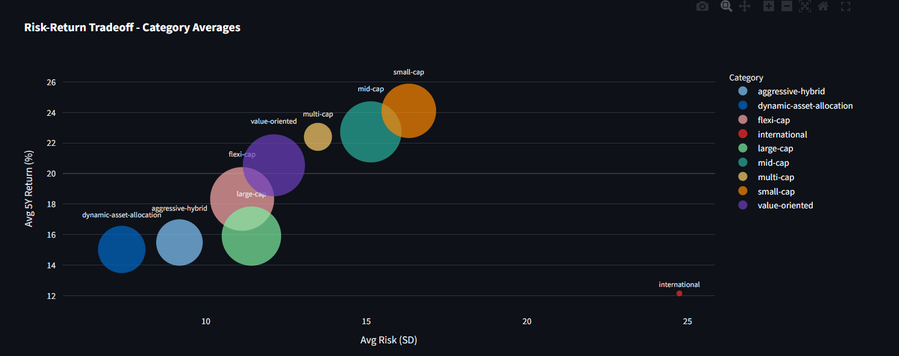
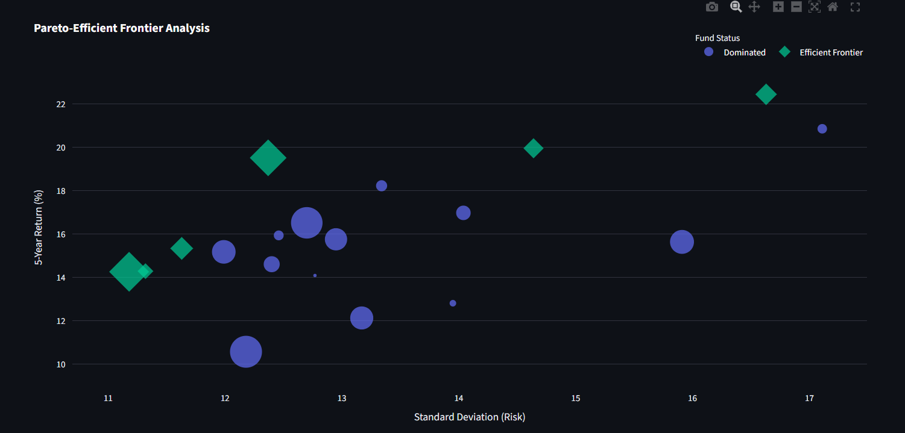
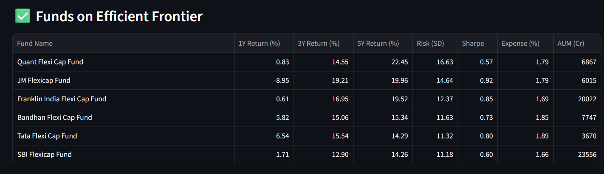

# ET Money Mutual Funds Scraper & Analytics Dashboard

[](https://www.python.org/downloads/)
[](LICENSE)
[](https://streamlit.io)
[](LICENSE)

A Python scraper that collects mutual funds data from ET Money across multiple categories, and an interactive Streamlit dashboard for visual analysis and fund selection.

> **Demo:** [Live Dashboard](https://mf-category-explorer.streamlit.app/) 

## Overview

This project helps investors analyze and compare mutual funds across categories using data-driven visualizations:
- 🎯 **Smart Fund Selection**: Identify Pareto-optimal funds on the efficient frontier
- 📊 **Category Comparison**: Compare fund categories using AUM-weighted metrics  
- 📈 **Distribution Analysis**: Visualize risk, return, and cost patterns
- 🔍 **Advanced Filtering**: Filter by return period, risk tolerance, expense ratio, and more

Perfect for investors who want to make informed decisions based on quantitative analysis rather than marketing materials.

## Screenshots

### Category Explorer
Compare fund categories using AUM-weighted averages and distribution analysis:



### Efficient Frontier Analysis
Identify Pareto-optimal funds with the best risk-return tradeoffs:



### Fund Selection
Browse and filter funds based on your criteria:



## Features

### Scraper
- **Dual scraping approach**: Uses `requests` + `BeautifulSoup4` for initial fetches, with automatic fallback to Playwright for JavaScript-rendered content
- **Multi-category support**: Scrapes multiple fund categories (Flexi-cap, Large-cap, Mid-cap, Small-cap, etc.)
- **Robust data extraction**: Parses structured data (`__NEXT_DATA__`, JSON-LD) and HTML content
- **Retry/backoff**: Built-in retry logic for failed requests with exponential backoff
- **Progress logging**: Console logs for tracking scraping progress
- **Error handling**: Gracefully handles missing data and continues scraping

### Analytics Dashboard
- **Category Explorer**: Compare fund categories using AUM-weighted averages
- **Distribution Analysis**: Box plots for returns, risk, cost, and size metrics
- **Efficient Frontier**: Identify Pareto-optimal funds within categories
- **Interactive Filters**: Customize analysis by return period, risk tolerance, expense ratio, AUM, and fund age
- **Visual Insights**: Plotly-based interactive charts for deep analysis

## Data Extracted

For each fund, the scraper extracts:

- **Fund Name**
- **Fund URL**
- **Fund Age (Years)**
- **AUM (₹ Cr)** - Assets Under Management in Crores
- **Expense Ratio** (%)
- **Alpha** - Excess return over benchmark
- **Sharpe Ratio** - Risk-adjusted return metric
- **Beta** - Market volatility measure
- **Standard Deviation (SD)** - Volatility measure
- **Portfolio Composition** - Large-cap %, Mid-cap %, Small-cap %, Other %
- **Returns** - 1M, 3M, 6M, 1Y, 3Y, 5Y, and Since Inception returns

## Quick Start - End-to-End Workflow

### Step 1: Scrape Fund Data

Scrape all fund categories (this will take some time):

```bash
# Scrape all categories listed in category_urls.txt
python scrape_etmoney_multicap.py
```

This creates CSV files in the `output/` directory:
- `etmoney_flexi-cap.csv`
- `etmoney_large-cap.csv`
- `etmoney_mid-cap.csv`
- `etmoney_small-cap.csv`
- etc.

### Step 2: Convert to Parquet Format

Combine all CSV files into a single optimized Parquet file:

```bash
python convert_to_parquet.py
```

This creates `output/all_funds.parquet` containing all funds from all categories.

### Step 3: Launch the Dashboard

Run the Streamlit analytics dashboard:

```bash
streamlit run reports/Category_Explorer.py
```

The dashboard will open in your browser at `http://localhost:8501`

**Dashboard Features:**
- **Category Explorer** (Main Page): Compare categories, view distributions
- **Efficient Frontier** (Page 2): Find optimal funds within a category

## Deployment to Streamlit Cloud

1. Go to [share.streamlit.io](https://share.streamlit.io)
2. Click "New app"
3. Select your GitHub repository
4. Set **Main file path**: `reports/Category_Explorer.py`
5. Click "Deploy"

Your dashboard will be live at `https://[your-app-name].streamlit.app`

**Note:** Ensure `output/all_funds.parquet`, `reports/`, and `requirements.txt` are in your repository.

## Installation

### Windows

1. **Clone or download this repository**

2. **Create a virtual environment** (recommended):
   ```powershell
   python -m venv venv
   .\venv\Scripts\Activate.ps1
   ```

   If you encounter execution policy errors, run:
   ```powershell
   Set-ExecutionPolicy -ExecutionPolicy RemoteSigned -Scope CurrentUser
   ```

3. **Install dependencies**:
   ```powershell
   pip install -r requirements.txt
   ```

4. **Install Playwright browsers**:
   ```powershell
   playwright install chromium
   ```

### macOS / Linux

1. **Clone or download this repository**

2. **Create a virtual environment** (recommended):
   ```bash
   python3 -m venv venv
   source venv/bin/activate
   ```

3. **Install dependencies**:
   ```bash
   pip install -r requirements.txt
   ```

4. **Install Playwright browsers**:
   ```bash
   playwright install chromium
   ```

## Usage

### Basic Usage

Scrape all Multi-Cap funds and save to default CSV file:

```bash
python scrape_etmoney_multicap.py
```

### Advanced Options

```bash
python scrape_etmoney_multicap.py --limit 10 --outfile my_funds.csv --sleep 1.5
```

### CLI Arguments

| Argument | Type | Default | Description |
|----------|------|---------|-------------|
| `--limit` | int | None | Maximum number of funds to scrape (None = all) |
| `--outfile` | str | `etmoney_multicap.csv` | Output CSV filename |
| `--sleep` | float | 0.8 | Delay between requests in seconds |

## Examples

### Scrape first 5 funds with custom output file

```bash
python scrape_etmoney_multicap.py --limit 5 --outfile test_funds.csv
```

### Scrape with slower rate limiting

```bash
python scrape_etmoney_multicap.py --sleep 2.0
```

## Dependencies

- Python 3.8+
- requests - HTTP library
- beautifulsoup4 - HTML parsing
- playwright - Browser automation (JavaScript fallback)
- urllib3 - HTTP retry logic
- streamlit - Dashboard framework
- pandas - Data manipulation
- plotly - Interactive visualizations
- pyarrow - Parquet file support

See [requirements.txt](requirements.txt) for specific versions.

## Project Structure

```
mf-performance-dashboard/
├── scrape_etmoney_multicap.py  # Main scraper script
├── convert_to_parquet.py       # CSV to Parquet converter
├── category_urls.txt           # List of fund category URLs to scrape
├── requirements.txt            # Python dependencies
├── LICENSE                     # MIT License
├── output/                     # Scraped data
│   ├── etmoney_*.csv          # Individual category CSVs
│   └── all_funds.parquet      # Combined Parquet file (for deployment)
└── reports/                    # Streamlit dashboard
    ├── Category_Explorer.py   # Main dashboard page
    ├── pages/
    │   └── 1_🎯_Efficient_Frontier.py  # Efficient frontier analysis
    └── README.md              # Dashboard design document
```

The scraper generates a CSV file with the following columns:

- `fund_name` - Name of the mutual fund
- `fund_url` - Full URL to the fund page
- `aum_cr` - Assets Under Management in Crores (₹)
- `expense_ratio` - Expense ratio (%)
- `alpha` - Alpha value
- `sharpe` - Sharpe ratio
- `beta` - Beta value
- `sd` - Standard deviation

Example output:

```csv
fund_name,fund_url,aum_cr,expense_ratio,alpha,sharpe,beta,sd
Axis Multicap Fund,https://www.etmoney.com/mutual-funds/axis-multicap-fund/42348,12500.5,1.75,2.3,1.8,0.95,15.2
...
```

## How It Works

1. **Fetch Category Page**: Retrieves the Multi-Cap funds listing page
2. **Extract Fund Links**: Parses all fund URLs matching the pattern `/mutual-funds/<slug>/<id>`
3. **Visit Each Fund**: 
   - First attempts to fetch with `requests`
   - If content appears JavaScript-rendered, falls back to Playwright
4. **Extract Data**:
   - Prioritizes structured data (`__NEXT_DATA__` JSON)
   - Falls back to HTML parsing with regex patterns
5. **Export to CSV**: Writes all collected data to the specified CSV file

## Troubleshooting

### Playwright Installation Issues

If Playwright fails to install browsers, run manually:

```bash
playwright install chromium
```

### Missing Data

If some fields are consistently missing, check the logs for warnings. The scraper will continue even if some fields can't be extracted.

### Rate Limiting / Blocking

If you encounter 429 (Too Many Requests) errors:

1. Increase the `--sleep` delay (e.g., `--sleep 2.0`)
2. Reduce concurrent scraping by using `--limit`

### Memory Issues

For very large scraping jobs, process in batches using `--limit`:

```bash
python scrape_etmoney_multicap.py --limit 50 --outfile batch1.csv
```

## License

This project is licensed under the **VCSL (Vibe-Coded Software License)** - see the [LICENSE](LICENSE) file for the full sarcastic details.

**TL;DR:** 
- ✨ This app is vibe-coded (it works, probably)
- 🚨 Don't base your investments on this - seriously, rethink your life choices if you do
- 🤷 Do whatever you want with the code - fork it, improve it, let an AI rewrite it
- 🤖 You're probably not writing any code yourself anyway (we all just prompt engineering now)
- 🙏 Don't blame me if things go sideways

**May the vibes be with you.** 🚀

## Contributing

Contributions are welcome! Feel free to:
- 🐛 Report bugs or issues
- 💡 Suggest new features or improvements
- 🔧 Submit pull requests

Please ensure your code follows the existing style and includes appropriate documentation.

## Acknowledgments

- Data source: [ET Money](https://www.etmoney.com)
- Built with [Streamlit](https://streamlit.io), [Plotly](https://plotly.com), and [Pandas](https://pandas.pydata.org)

## Notes

- The scraper includes polite delays between requests (default 0.8s)
- Retry logic with exponential backoff is built-in for transient failures
- Logs warnings for missing data but continues scraping
- Supports both Windows and Unix-like systems
